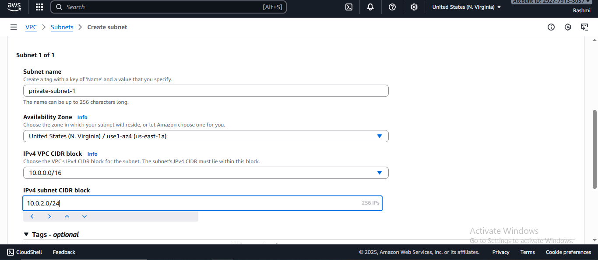
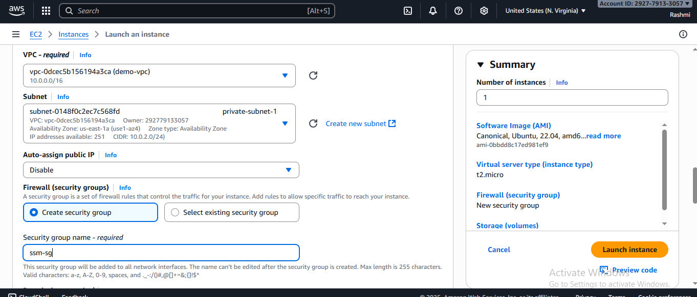
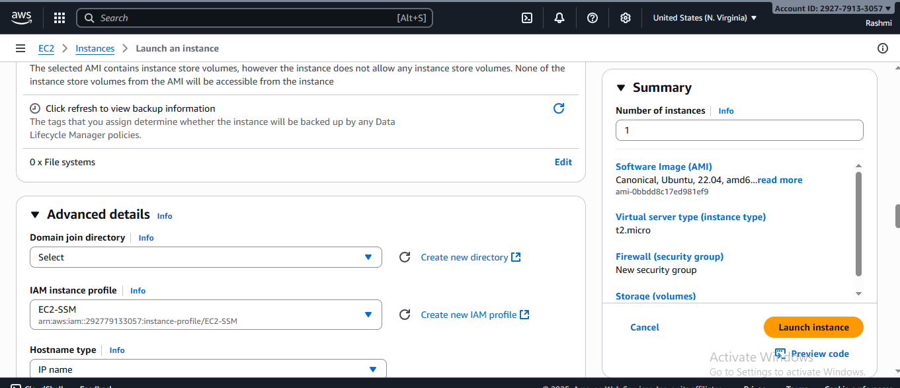
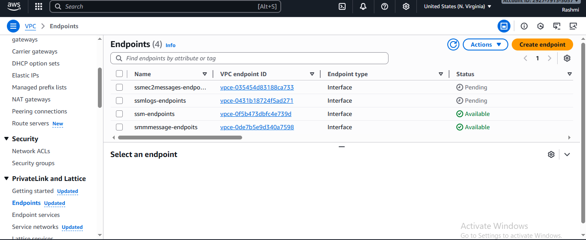
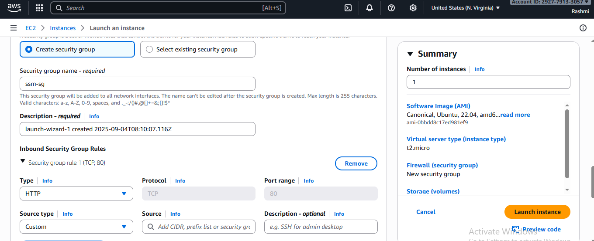
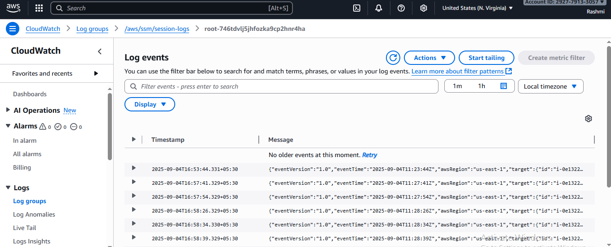
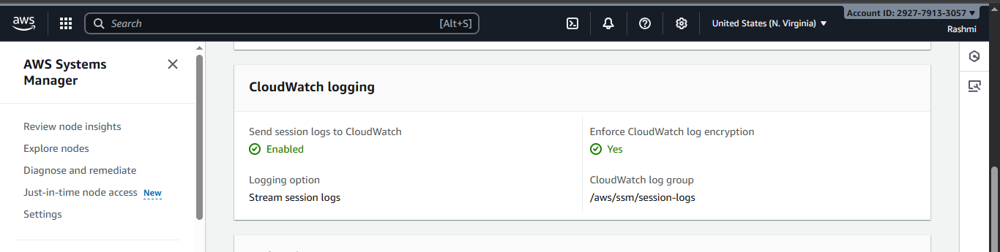
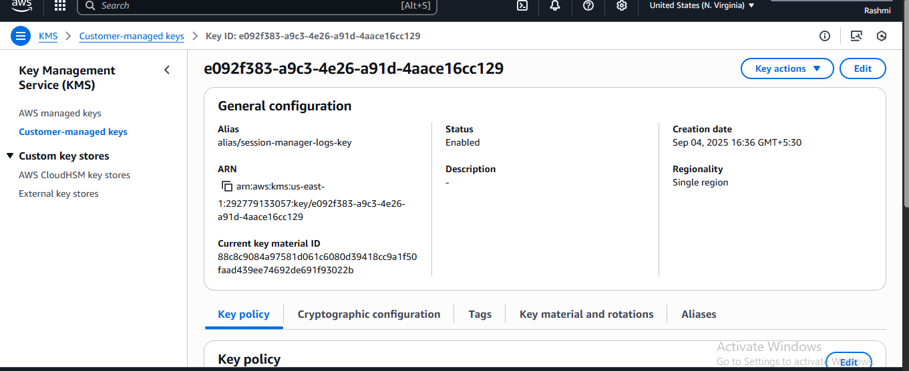
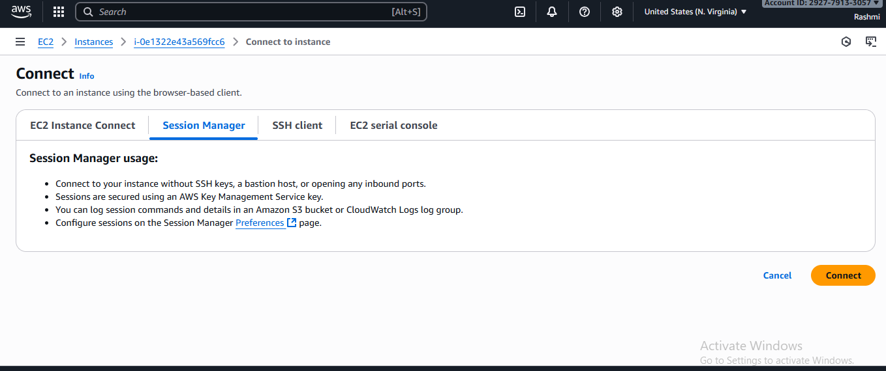

# 🚀 Deploy EC2 in Private Subnet with Session Manager (Using VPC Endpoints)

This guide demonstrates how to securely connect to an **EC2 instance in a private subnet** without SSH,  
by using **AWS Systems Manager (SSM) Session Manager** with **VPC Endpoints**.

---

## 🔑 Why Use VPC Endpoints?
- Private EC2 instances **without internet access** can still connect to SSM.  
- Avoids the need for a **NAT Gateway** or **Bastion host** (cost saving 💰).  
- Improves security (no inbound rules or public IP required).  

---

## 📘 Steps

### 1️ Prerequisites
- A **VPC with private subnets**.  
- An **EC2 instance** launched in the private subnet with **no public IP**.  
- **SSM Agent** preinstalled:  
  - ✅ Amazon Linux 2 / 2023 → installed & running by default.  
  - ✅ Ubuntu 16.04, 18.04, 20.04, 22.04 (LTS) → included as snap package.  

  


---

### 2️ Create IAM Role for EC2
Attach an IAM Role with policies:  
- `AmazonSSMManagedInstanceCore`  
- Custom CloudWatch logging policy (for session logs)  

👉 See [iam-policy.md](../prerequisites/iam-policy.md) for full JSON policies.  



---

### 3️ Create VPC Endpoints
Go to **VPC → Endpoints → Create Endpoint** and add the following **Interface Endpoints** (attach to private subnets, security group with no inbound rules needed):  
- `com.amazonaws.<region>.ssm`  
- `com.amazonaws.<region>.ec2messages`  
- `com.amazonaws.<region>.ssmmessages`  
- (Optional for logging) `com.amazonaws.<region>.logs`  

  


---

### 4️ Enable Session Logging
In **SSM → Session Manager → Preferences**:  
- Enable **CloudWatch Logs** (create or use a log group).  
- (Optional) Enable **KMS encryption** for logs.  

⚠️ Make sure your EC2 role includes permissions for CloudWatch Logs (see [iam-policy.md](../prerequisites/iam-policy.md)).  

  
  


---

### 5️ Connect to EC2 via Session Manager
1. Go to **EC2 Console → Instances → Connect → Session Manager** tab.  
2. Click **Connect**.  
3. A browser-based terminal will open to your EC2.  

No SSH keys, no inbound rules, no public IP required 🎉.  



---

## ✅ Verification
- Run `ls -l /` in Session Manager terminal to confirm access.  
- Run:  
  ```bash
  aws ssm describe-instance-information
