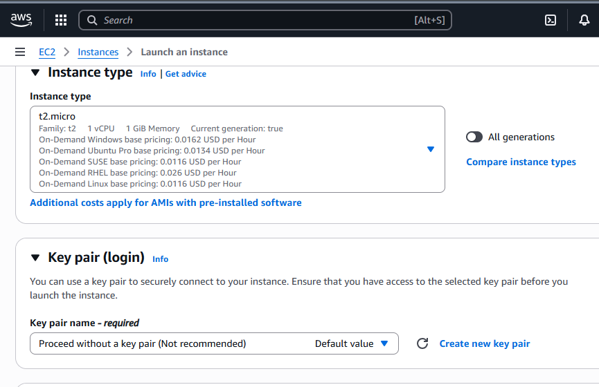
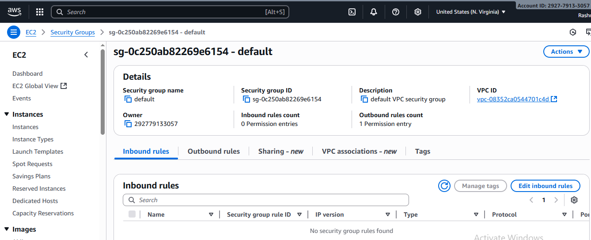
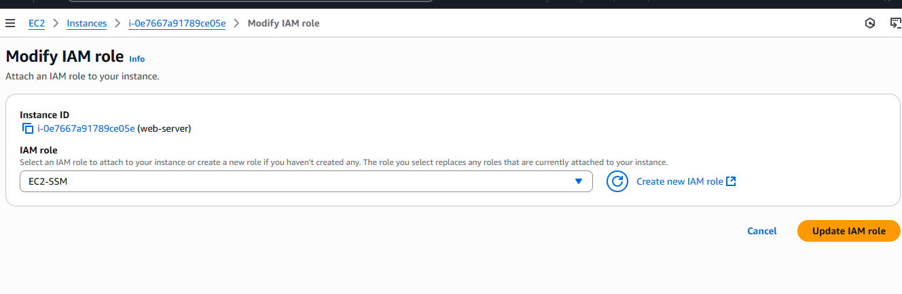
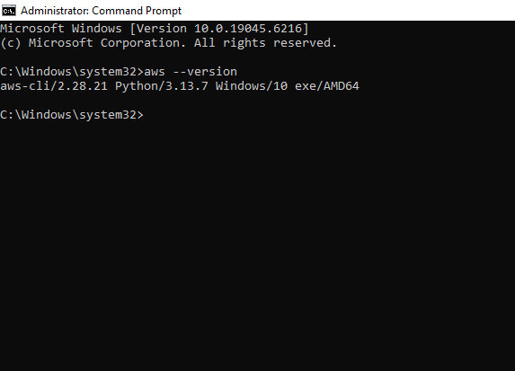
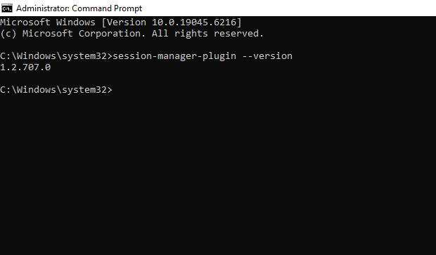
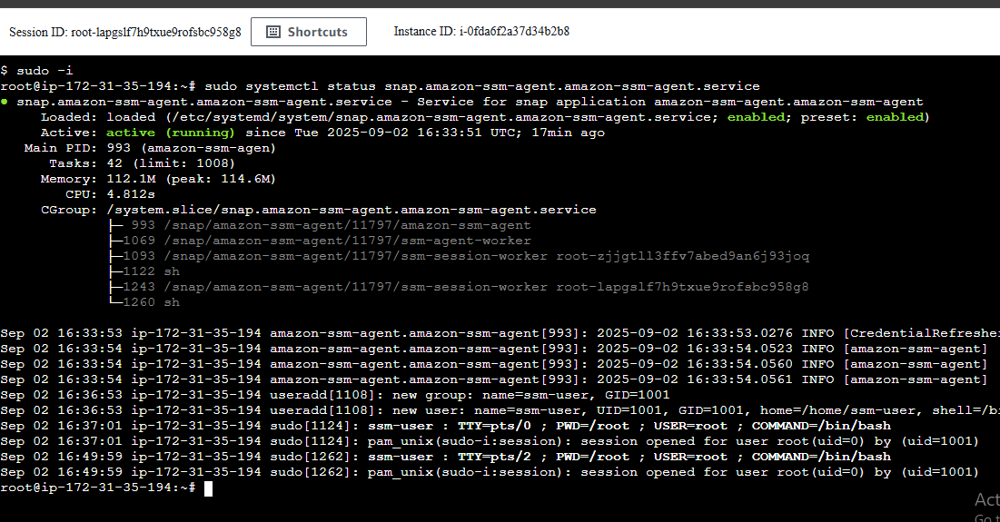
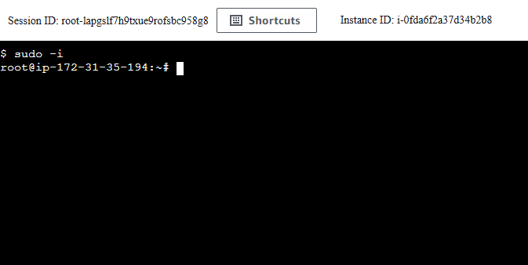
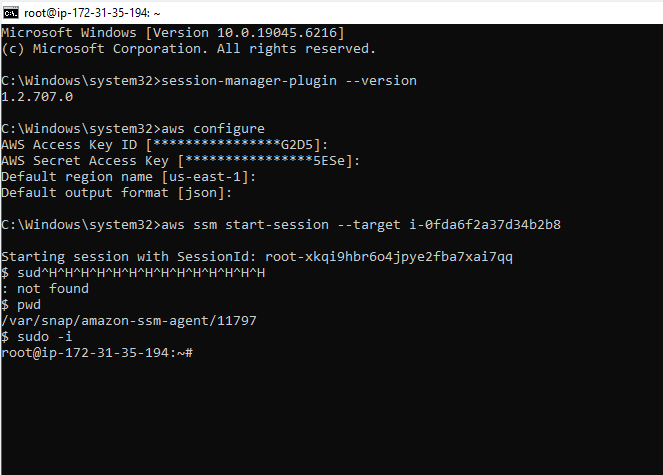
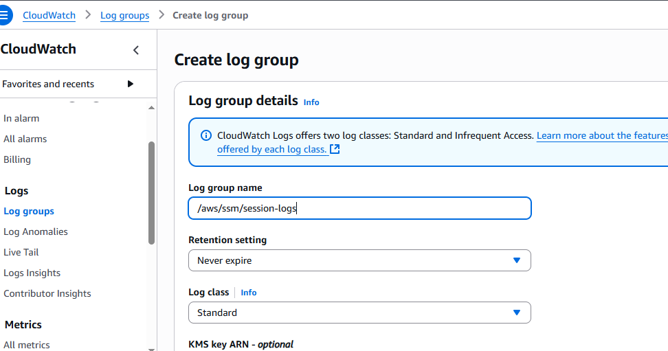
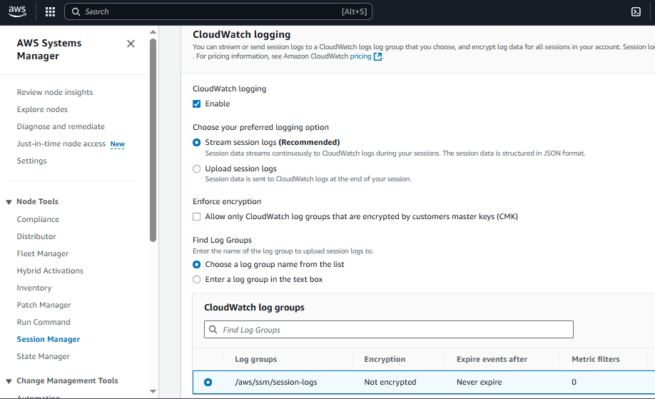

# 🔐 AWS Session Manager – Secure EC2 Access Without SSH

Securely access EC2 instances **without SSH keys or open ports**, using **AWS Systems Manager Session Manager (SSM)**.

---

##  Step 1: Launch EC2 Instance (Without SSH)
While creating the EC2 instance:
- **Do not select a key pair** → prevents SSH access.  
- **Do not add a security group inbound rule** → no SSH port needed.  

  


---

##  Step 2: Attach IAM Role to EC2
- Create an IAM role with `AmazonSSMManagedInstanceCore` managed policy.  
- Attach CloudWatch Logs custom policy (for session logging).  

👉 Full IAM + CloudWatch policy JSON is in [iam-policy.md](../prerequisites/iam-policy.md).  



---

##  Step 3: Install AWS CLI & Session Manager Plugin (Windows)
For CLI-based access:  

- Install AWS CLI:  
  ```powershell
  choco install awscli



- Install Session Manager Plugin:
  ```powershell
  choco install awscli-session-manager
  ```



---
## Step 4: Verify SSM Agent on EC2

The SSM Agent is preinstalled on:

✅ Amazon Linux 2 / 2023

✅ Ubuntu 16.04, 18.04, 20.04, 22.04 (LTS)

To verify:
On Amazon Linux
```bash 
sudo systemctl status amazon-ssm-agent
```
On Ubuntu 
```bash
sudo systemctl status snap.amazon-ssm-agent.amazon-ssm-agent.service
```
If it shows `active (running)`, the agent is ready.



For custom AMIs, install manually:
```bash
sudo apt-get update
sudo snap install amazon-ssm-agent --classic
sudo systemctl start amazon-ssm-agent
sudo systemctl enable amazon-ssm-agent
```

---
## Step 5: Connect to EC2
### Option 1: AWS Console
1. Go to **EC2 Dashboard**.
2. Select your instance.
3. Click **Connect**, then choose **Session Manager**.
4. Start your browser-based shell session.



---
### Option 2: AWS CLI (Windows / Ubuntu)
- From **Windows (PowerShell)**:
1. Configure your AWS CLI:
```powershell
aws configure
AWS Access Key ID: <your-access-key>
AWS Secret Access Key: <your-secret-key>
Default region name: <your-region>
Default output format: <json>
```
2. Start Session: 
aws ssm start-session --target <instance-id>



---
## Step 6: Enable CloudWatch Logs in Session Manager
1. Create a CloudWatch Log Group (e.g., `/aws/ssm/session-logs`).



2. In SSM → Session Manager → Preferences:
   - Enable CloudWatch Logs.
   - Select the created log group.


---
## Final Setup Summary
- EC2 launched **without keypair, without public subnet, and without security group inbound rules**.
- No Internet Gateway (IGW) is attached → instance has no direct internet access.
- IAM role with `AmazonSSMManagedInstanceCore` attached.
- Access only via **AWS Session Manager**.

✅ This setup is secure, private, and removes the need for SSH keys or open ports.
