# AWS Session Manager – Secure EC2 Access Without SSH
## What is AWS Session Manager?

#### AWS Session Manager lets you securely connect and manage your servers or virtual machines (VMs) without opening network ports or using SSH keys. You can start remote sessions to your EC2 instances, on-premises servers, or VMs using a web browser or command-line tools.
---
## Problems with Traditional SSH
- You need to manage SSH key files.  
- Port 22 must be open for SSH access (which is a security risk).  
- Bastion hosts are often required for private instances.  
- Security groups become harder to manage when allowing SSH access.  
---
## Why Use Session Manager?
- No SSH keys needed.  
- No inbound ports need to be open.  
- No bastion host required.  
- Sessions are secure and encrypted.  
- Session activity can be logged for auditing.  
---
## Step 1: Launch EC2 Instance (Without SSH)
While creating the EC2 instance:
- **Do not select a key pair** → prevents SSH access. 


  
- **Do not add a security group** → no inbound rules are required.    

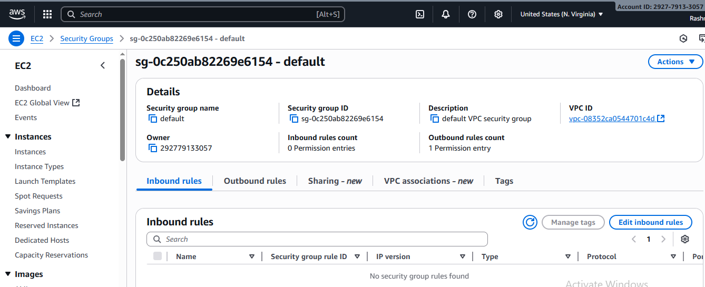
  
---
## Step 2: Attach IAM Role to EC2
- Create an IAM role with `AmazonSSMManagedInstanceCore` managed policy. 

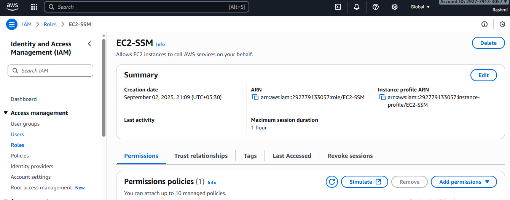 

- Attach CloudWatch Logs custom policy for logging.  - EC2SSMCloudWatchLogs

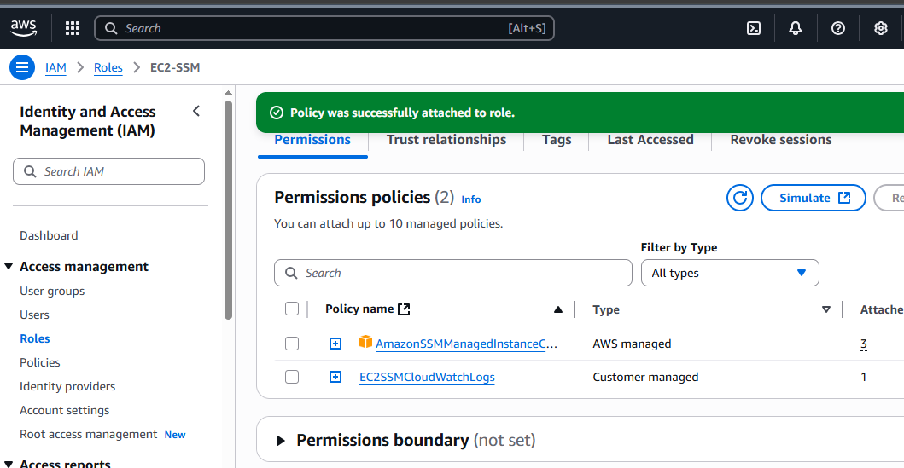

- Attach this role to the EC2 instance.  

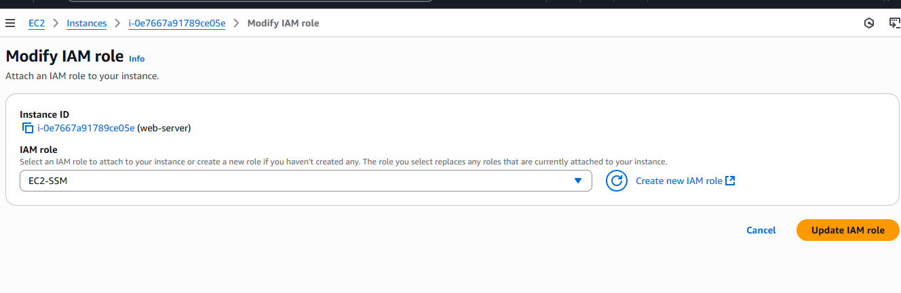
 
---
## Step 3: Prerequisites on Windows (for CLI Access)
- Install AWS CLI:  
  ```powershell
  choco install awscli
```

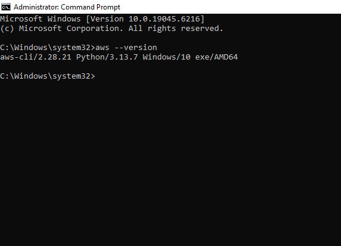


- Install Session Manager Plugin:  
  ```powershell
  choco install awscli-session-manager
  ```

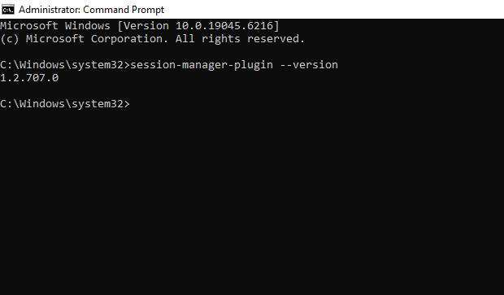

---
## Step 4: Verify SSM Agent on EC2
The **SSM Agent** is **pre-installed** on:
- Amazon Linux 2  
- Ubuntu 20.04 and newer  
👉 If you are using these AMIs, you don’t need to install it manually.  
To verify:
```bash
sudo systemctl status snap.amazon-ssm-agent.amazon-ssm-agent.service
```
If it shows `active (running)`, the agent is ready.

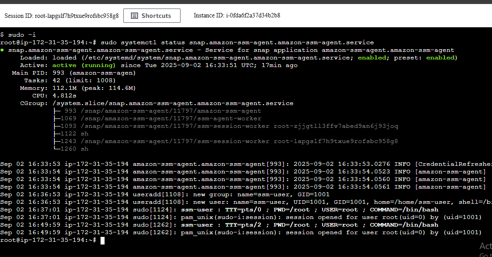
  
If not installed (e.g., custom AMI), install manually:
```bash
sudo apt-get update
sudo snap install amazon-ssm-agent --classic
sudo systemctl start amazon-ssm-agent
sudo systemctl enable amazon-ssm-agent
```  
---
## Step 5: Connect to EC2
### Option 1: AWS Console
1. Go to **EC2 Dashboard**.  
2. Select your instance.  
3. Click **Connect**, then choose **Session Manager**.  
4. Start your browser-based shell session.  

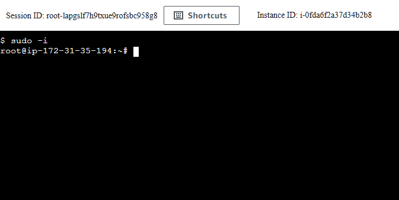

---
### Option 2: AWS CLI (Windows / Ubuntu)
- From **Windows (PowerShell)**:
```powershell
aws ssm start-session --target <instance-id>
aws configure
AWS Access Key ID: <your-access-key>
AWS Secret Access Key: <your-secret-key>
Default region name: <your-region>
Default output format: <json>
```

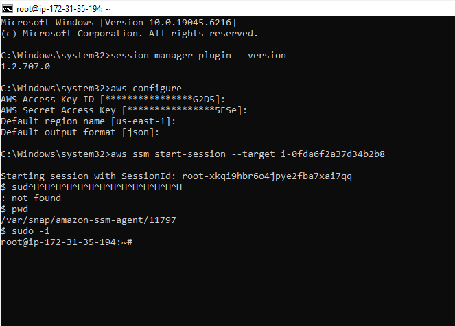

---
## Step 6: Enable CloudWatch Logs in Session Manager
1. Create a CloudWatch Log Group (e.g., `/aws/ssm/session-logs`).  

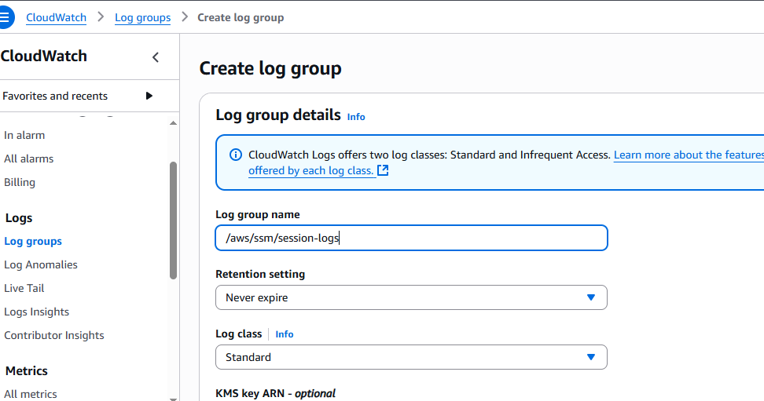
2. In the **AWS Systems Manager console**, go to **Session Manager → Preferences**.  
3. Enable **CloudWatch logging** and select the log group.  

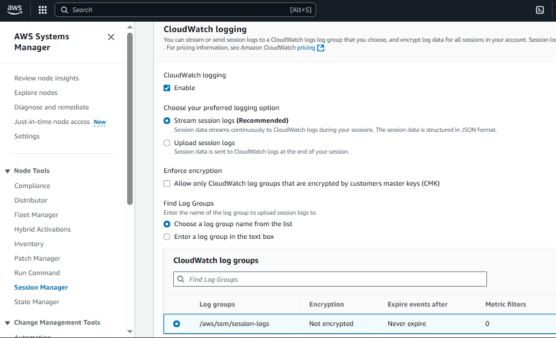
4. Save preferences to enable session logging.  
  
---
## Final Setup Summary
- EC2 launched **without keypair, without public subnet, and without security group inbound rules**.  
- No Internet Gateway (IGW) is attached → instance has no direct internet access.  
- IAM role with `AmazonSSMManagedInstanceCore` attached.  
- Access only via **AWS Session Manager**.  
✅ This setup is secure, private, and removes the need for SSH keys or open ports.  
